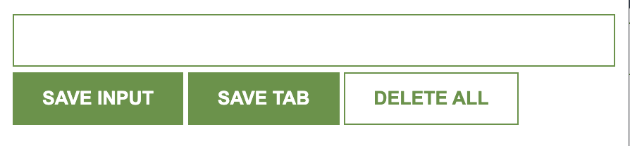

# Lead Tracker Chrome Extension

This is a simple Chrome Extension that allows users to save and manage links (leads) directly from their browser. You can either enter a link manually or save the currently active tab with one click. All saved leads are stored locally using `localStorage`.

## 🔗 Features

- Save a link manually using the input field
- Save the current browser tab
- Display all saved links as clickable list items
- Delete all saved links (double-click the delete button)
- Links persist using browser's `localStorage`

## 🧠 Technologies Used

- **HTML5**: Structure of the extension
- **CSS3**: Styling for the UI components
- **JavaScript (ES6)**: Application logic including DOM manipulation and localStorage
- **Chrome Extension API**: `chrome.tabs.query()` to fetch the current tab URL

## 🌐 How to Use

1. **Clone the repository** or download the files.
2. **Go to** `chrome://extensions/` in your Chrome browser.
3. **Enable** Developer Mode (top right).
4. **Click** "Load unpacked" and select the folder containing this project.
5. **Pin** the extension from the extensions menu.
6. Click the extension icon, start adding links, and manage your leads!

## 📸 UI Preview

## 📃 License

This project is licensed under the MIT License.
